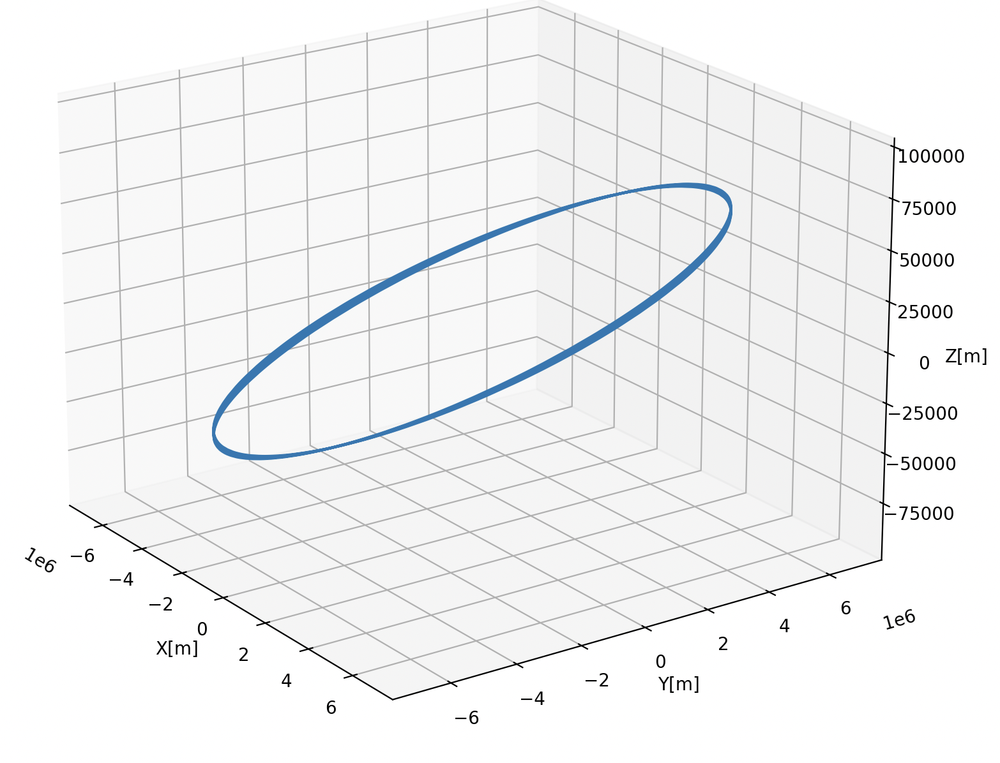

# Simple Orbit Simulation
This repository implements a simple orbit simulation which uses JGM-3 coefficients with spherical harmonic geopotential model to compute acceleration due to gravity. For simplicity only degree 2 zonal coefficient is used as zonal coefficients corresponding to degree >2 are significantly smaller than the zonal coefficients corresponding to degree 2. Also tesseral and sectoral terms have been ignored since their contributions are also insignificant for For a satellite requiring accuracies of a few meters.[Ref](https://spsweb.fltops.jpl.nasa.gov/portaldataops/mpg/MPG_Docs/Source%20Docs/gravity-SphericalHarmonics.pdf)

## Limitations

- Only tested for Low Earth Orbits. Orbit height between 600 - 2000km above mean Earth radius.
- Doesn't consider gravitational impact of other celestial bodies for ex. Sun and Moon.
- Oversimplified for demo implementation.

## Setup
- Install cmake and an appropriate c++ compiler for your system.
- Clone https://github.com/tmandal1988/orbit_modeling.git

## Testing
```sh
cd orbit_modeling
cmake -S . -B build
make -C build
./build/ORBITSIM
```
To keep things simple the test case is hardcoded in `main.cc`. The test was implemented for a satellite with an initial position of  `[6.778100e6, 0.0, 100e3]` m in ECI frame and an initial velocity of `7.66e3` m/s. Satellite orbit was simulated for `27000`s duration and the results in a .csv file which can be used for plotting in post run analysis. The plot of the test case looks like following.
